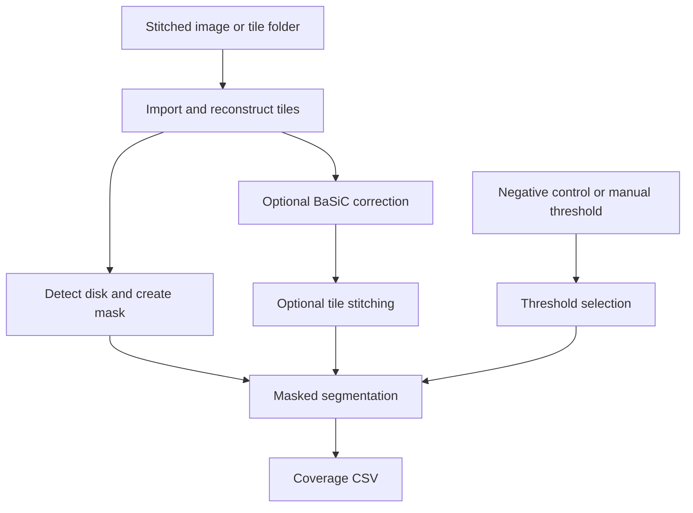

# BAIwatch

**BAIwatch** is a JIPipe workflow for automated quantification of fluorescence-positive surface coverage on circular biomaterial samples. It supports both stitched microscopy mosaics and folders of unstitched tiles, and combines tile reconstruction, optional illumination correction, disk detection, threshold-based segmentation, and masked coverage measurement in one reproducible pipeline.

The current workflow was developed for quantifying bacterial adhesion on titanium disks, but it can be adapted to other circular samples imaged by fluorescence microscopy.

## Features

- Processes either stitched images or folders of unstitched image tiles.
- Supports raster and serpentine tile-acquisition patterns.
- Selects a user-defined channel, Z-slice, and time point through Bio-Formats.
- Imports large stitched images in memory-safe blocks.
- Optionally estimates and applies flat-field and dark-field correction with BaSiC.
- Detects the circular sample boundary using edge detection and template correlation.
- Reuses saved disk ROIs in subsequent runs.
- Optionally stitches corrected tiles with ImageJ's Grid/Collection Stitching plugin.
- Determines the segmentation threshold from a negative control or a manual value.
- Calculates fluorescence-positive coverage only within the detected disk area.
- Exports one CSV results table for each processed dataset.

## Workflow



## Requirements

- [Fiji/ImageJ](https://fiji.sc/) with:
  - [Bio-Formats](https://www.openmicroscopy.org/bio-formats/)
  - [BaSiC](https://github.com/marrlab/BaSiC)
  - Grid/Collection Stitching
- [JIPipe 6.0.0](https://www.jipipe.org/)
- Python 3.10 with the JIPipe Python adapter
- Python packages:
  - `numpy`
  - `pandas`
  - `scipy`
  - `scikit-image`
  - `opencv-python`

The `.jip` project references the JIPipe prepackaged Python 3.10.15 environment and Python adapter 0.3.0.

## Installation

1. Download or clone this repository.
2. Install Fiji and JIPipe 6.0.0.
3. Confirm that Bio-Formats, BaSiC, and Grid/Collection Stitching are available in Fiji.
4. Open the BAIwatch `.jip` project in JIPipe.
5. In **Project settings → User directories**, set:
   - `InputPath` to the folder containing the input datasets.
   - `OutputPath` to the folder where the results should be written.
6. Check the global parameters and run the project.

## Input organization

### Stitched images

Set `InputMode` to `stitched`. Place the sample images directly in the input folder. If a negative control is used, place it in the same folder and enter its filename including the extension in `nameOfNegativeControl`.

```text
input/
├── sample_01.tif
├── sample_02.tif
└── negative_control.tif
```

For mosaics containing multiple reconstructed tiles, provide `TileWidth` and `TileHeight`, `TilesX` and `TilesY`, or a consistent combination from which the missing values can be inferred. If the values are missing, the complete image is treated as one tile. Inconsistent values trigger a single-tile fallback.

### Unstitched tiles

Set `InputMode` to `unstitched`. Store each dataset in a separate subfolder. Tile filenames must contain numbers that reflect the acquisition sequence.

```text
input/
├── sample_01/
│   ├── tile_0001.tif
│   ├── tile_0002.tif
│   └── ...
├── sample_02/
│   └── ...
└── negative_control/
    └── ...
```

Enter the negative-control folder name, without a file extension, in `nameOfNegativeControl`. For unstitched inputs, `TilesX`, `TilesY`, `OverlapX`, `OverlapY`, and `TileScanOrder` are required.

## Parameters

The values below are the defaults stored in the current workflow. They should be adapted to the imaging setup and dataset.

| Parameter | Default | Description |
| --- | ---: | --- |
| `InputMode` | `unstitched` | Input type: `stitched` image or folder of `unstitched` tiles. |
| `nameOfNegativeControl` | empty | Negative-control filename for stitched input or folder name for unstitched input. |
| `CoverageThreshold` | `162` | Manual fluorescence-intensity threshold. Use this only when no negative control is specified. |
| `Radius` | `14` | Physical radius of the circular sample in millimetres. |
| `Resolution` | `345` | Image resolution in nanometres per pixel, used to convert the disk radius to pixels. |
| `C` | `1` | One-based channel index to analyse. |
| `Z` | `1` | One-based Z-slice index to analyse. |
| `T` | `1` | One-based time-point index to analyse. |
| `StackOrder` | `XYCZT` | Dimension order used by Bio-Formats. |
| `TileWidth` | empty | Tile width in pixels for stitched mosaics. |
| `TileHeight` | empty | Tile height in pixels for stitched mosaics. |
| `TilesX` | `23` | Number of tiles along the X direction. |
| `TilesY` | `23` | Number of tiles along the Y direction. |
| `OverlapX` | `10` | Horizontal overlap between adjacent tiles, in percent. |
| `OverlapY` | `10` | Vertical overlap between adjacent tiles, in percent. |
| `TileScanOrder` | `Raster` | Tile order: `Raster` or `Serpentine`. |
| `ApplyBaSiC` | `true` | Apply BaSiC illumination correction. Requires more than one tile. |
| `Stitching` | `true` | Stitch processed tiles. Requires more than one tile and nonzero overlap in at least one direction. |
| `Scale` | `0.1` | Scaling factor applied during tile reconstruction; `1` preserves the original dimensions. |
| `MaxBlockPixels` | `250000000` | Maximum number of pixels imported in one block for a large stitched image. |

Exactly one threshold source must be provided: either `nameOfNegativeControl` or `CoverageThreshold`. Providing both, or leaving both empty, stops the workflow with an error.

For a single-tile dataset (`TilesX = 1` and `TilesY = 1`), both `ApplyBaSiC` and `Stitching` must be disabled.

## Output

BAIwatch writes a timestamped CSV file to `OutputPath` using the pattern:

```text
<datetime>_<dataset-folder>_results.csv
```

The final table contains:

| Column | Description |
| --- | --- |
| `File` | Name of the processed image or dataset. |
| `CoveragePercent (%)` | Percentage of the detected disk area classified as fluorescence-positive. |

When automatic thresholding is used, the workflow also calculates the negative-control mean intensity, standard deviation, and resulting coverage threshold internally. Disk ROIs are stored next to their corresponding inputs as ZIP files so that later runs can reproduce the same mask.

## Important notes

- Use the same acquisition settings and intensity scale for samples and their negative control.
- Confirm that the disk radius and image resolution are given in the requested units.
- Do not use both a manual threshold and a named negative control.
- BaSiC and stitching require a multi-tile dataset.
- Very large images may require a lower `MaxBlockPixels` value, depending on available memory.
- Inspect newly generated disk ROIs before relying on the measurements. Existing ROI ZIP files are loaded automatically on later runs.

## Citation

A formal citation for BAIwatch will be added after publication. Until then, please cite this repository and the principal software used by the workflow:

- Gerst R, Cseresnyés Z, Figge MT. **JIPipe: visual batch processing for ImageJ.** *Nature Methods*. 2023. [https://doi.org/10.1038/s41592-022-01744-4](https://doi.org/10.1038/s41592-022-01744-4)
- Peng T, Thorn K, Schroeder T, et al. **A BaSiC tool for background and shading correction of optical microscopy images.** *Nature Communications*. 2017;8:14836. [https://doi.org/10.1038/ncomms14836](https://doi.org/10.1038/ncomms14836)
- Linkert M, Rueden CT, Allan C, et al. **Metadata matters: access to image data in the real world.** *Journal of Cell Biology*. 2010;189:777–782. [https://doi.org/10.1083/jcb.201004104](https://doi.org/10.1083/jcb.201004104)

## Author and contact

**Mounir Zerdani**  
Applied Systems Biology, Leibniz Institute for Natural Product Research and Infection Biology – Hans Knöll Institute, Jena, Germany  
Email: [Mounir.Zerdani@leibniz-hki.de](mailto:Mounir.Zerdani@leibniz-hki.de)  
ORCID: [0009-0003-5851-0951](https://orcid.org/0009-0003-5851-0951)

## License

This project is licensed under the [MIT License](LICENSE).
